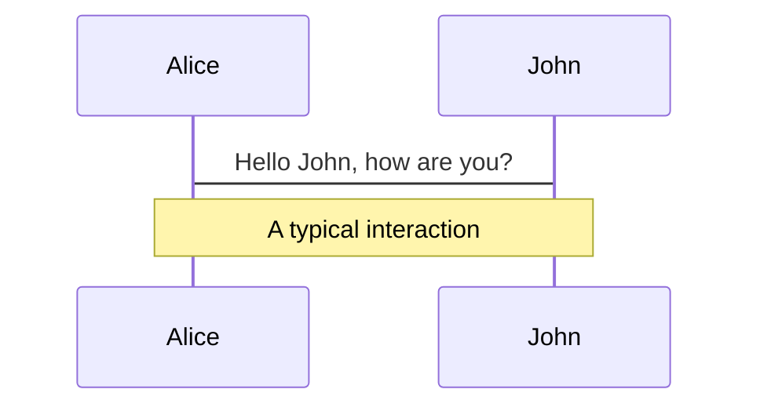
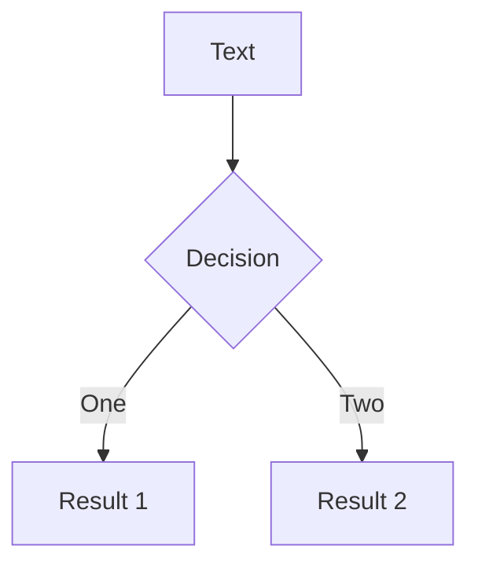
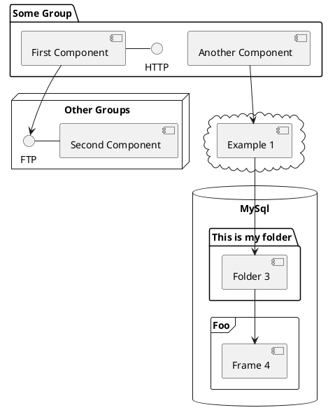

---
# try also 'default' to start simple
theme: seriph
# random image from a curated Unsplash collection by Anthony
# like them? see https://unsplash.com/collections/94734566/slidev
background: https://www.mindinventory.com/blog/wp-content/uploads/2018/07/reactjs-1200x600.jpg
# apply any windi css classes to the current slide
class: 'text-center'
# https://sli.dev/custom/highlighters.html
highlighter: shiki
# show line numbers in code blocks
lineNumbers: false
# some information about the slides, markdown enabled
info: |
  ## Slidev Starter Template
  Presentation slides for developers.

  Learn more at [Sli.dev](https://sli.dev)
# persist drawings in exports and build
drawings:
  persist: false
# use UnoCSS (experimental)
css: unocss
---

# React


<!-- <div class="pt-12">
  <span @click="$slidev.nav.next" class="px-2 py-1 rounded cursor-pointer" hover="bg-white bg-opacity-10">
    Press Space for next page <carbon:arrow-right class="inline"/>
  </span>
</div>

<div class="abs-br m-6 flex gap-2">
  <button @click="$slidev.nav.openInEditor()" title="Open in Editor" class="text-xl icon-btn opacity-50 !border-none !hover:text-white">
    <carbon:edit />
  </button>
  <a href="https://github.com/slidevjs/slidev" target="_blank" alt="GitHub"
    class="text-xl icon-btn opacity-50 !border-none !hover:text-white">
    <carbon-logo-github />
  </a>
</div> -->

<!--
The last comment block of each slide will be treated as slide notes. It will be visible and editable in Presenter Mode along with the slide. [Read more in the docs](https://sli.dev/guide/syntax.html#notes)
-->

---
layout: center
class: text-center
---
# React?

<br>
<br>

<h2><u>libreria</u> <u>Javascript</u> per la creazione di <u>Web UI</u> <u>dinamiche</u></h2>


<!--
You can have `style` tag in markdown to override the style for the current page.
Learn more: https://sli.dev/guide/syntax#embedded-styles
-->

<style>
h1 {
  background-color: #2B90B6;
  background-image: linear-gradient(45deg, #4EC5D4 10%, #146b8c 20%);
  background-size: 100%;
  -webkit-background-clip: text;
  -moz-background-clip: text;
  -webkit-text-fill-color: transparent;
  -moz-text-fill-color: transparent;
}
</style>

---
layout: center
class: text-center
---
# Maggio 2013

[Why did we build React?](https://reactjs.org/blog/2013/06/05/why-react.html)

<br>
<br>

# Marzo 2015
[Introducing React Native](https://reactjs.org/blog/2015/03/26/introducing-react-native.html)

<br>
<br>

# Febbraio 2019
[React v16.8: The One With Hooks](https://reactjs.org/blog/2019/02/06/react-v16.8.0.html)

<br>
<br>

# Marzo 2022
[React v18.0](https://reactjs.org/blog/2022/03/29/react-v18.html)

---
layout: center
class: text-center
---
# React in un minuto

<iframe height="400px" width="800px"  scrolling="no" title="Untitled" src="https://codepen.io/andtos90/embed/LYrVKOy?default-tab=result" frameborder="no" loading="lazy" allowtransparency="true" allowfullscreen="true">
  See the Pen <a href="https://codepen.io/andtos90/pen/LYrVKOy">
  Untitled</a> by Andrea Tosatto (<a href="https://codepen.io/andtos90">@andtos90</a>)
  on <a href="https://codepen.io">CodePen</a>.
</iframe>

---

# Come iniziare

<div grid="~ cols-2 gap-4">
<div>
```html {all|4-5|8-15|17-18|all|none}
<!-- index.html -->
<body>
  <h2>React in un minuto</h2>
  <!-- We will put our React component inside this div. -->
  <div id="like-button-root"></div>

  <!-- Load React. -->
  <!-- Note: when deploying, replace "development.js" with "production.min.js". -->
  <script
  src="https://unpkg.com/react@18/umd/react.development.js">
  </script>

  <script 
  src="https://unpkg.com/react-dom@18/umd/react-dom.development.js">
  </script>

  <!-- Load your React component. -->
  <script src="like-button.js"></script>
</body>
```
</div>

<div>
```js {none|all|17-19|3-15|6-14|4|10-14|6-8|all}
// like-button.js

function LikeButton() {
  const [liked, setLiked] = React.useState(false);

  if (liked) {
    return 'You liked this!';
  }

  return React.createElement(
    'button',
    { onClick: () => setLiked(true) },
    'Like'
  );
}

const rootNode=document.getElementById('like-button-root');
const root=ReactDOM.createRoot(rootNode);
root.render(React.createElement(LikeButton));
```
  </div>
</div>

[Add React to a Website - React Docs](https://beta.reactjs.org/learn/add-react-to-a-website)
---

# JSX - 1 

<div grid="~ cols-2 gap-4">
<div>
```js {all|10-14}
// like-button.js

function LikeButton() {
  const [liked, setLiked] = React.useState(false);

  if (liked) {
    return 'You liked this!';
  }

  return React.createElement(
    'button',
    { onClick: () => setLiked(true) },
    'Like'
  );
}

const rootNode=document.getElementById('like-button-root');
const root=ReactDOM.createRoot(rootNode);
root.render(React.createElement(LikeButton));
```
  </div>
  <div>
```js {all|10-14}
// like-button.js

function LikeButton() {
  const [liked, setLiked] = React.useState(false);

  if (liked) {
    return 'You liked this!';
  }

  return (
    <button onClick={() => setLiked(true)}>
      Like
    </button>
  );
}

const rootNode=document.getElementById('like-button-root');
const root=ReactDOM.createRoot(rootNode);
root.render(React.createElement(LikeButton));
```
  </div>
</div>

[Try JSX - React Docs](https://beta.reactjs.org/learn/add-react-to-a-website#try-jsx)<br>
[Writing Markup with JSX - React Docs](https://beta.reactjs.org/learn/writing-markup-with-jsx)
---

# JSX - 2

<div id="wrap">
  <iframe id="scaled-frame" src="https://transform.tools/html-to-jsx"></iframe>
</div>

<style>
#wrap {
  width: 900px;
  height: 400px;
  padding: 0;
  overflow: hidden;
}

#scaled-frame {
  width: 1800px;
  height: 800px;
  border: 0px;
}

#scaled-frame {
  zoom: 0.5;
  -moz-transform: scale(0.5);
  -moz-transform-origin: 0 0;
  -o-transform: scale(0.5);
  -o-transform-origin: 0 0;
  -webkit-transform: scale(0.5);
  -webkit-transform-origin: 0 0;
}

@media screen and (-webkit-min-device-pixel-ratio:0) {
  #scaled-frame {
    zoom: 1;
  }
}
</style>

---

# Componenti - Riutilizzo

<div grid="~ cols-2 gap-4">
<div>
```js {all|2,6,11,18-19}
// like-button.js
function LikeButton({ title }) {
  const [liked, setLiked] = React.useState(false);

  if (liked) {
    return 'You liked ' + title;
  }

  return (
    <button onClick={() => setLiked(true)}>
      Like {title}
    </button>
  );
}
const rootNode=document.getElementById('like-button-root');
const root=ReactDOM.createRoot(rootNode);
root.render(<>
    <LikeButton title={"Cuccioli"} />
    <LikeButton title={"Bambini"} />
  </>);
```
</div>
  <div>
  <br>
  <iframe height="250" width="420" scrolling="no" title="Untitled" src="https://codepen.io/andtos90/embed/ZERbzXq?default-tab=result" frameborder="no" loading="lazy" allowtransparency="true" allowfullscreen="true">
  See the Pen <a href="https://codepen.io/andtos90/pen/ZERbzXq">
  Untitled</a> by Andrea Tosatto (<a href="https://codepen.io/andtos90">@andtos90</a>)
  on <a href="https://codepen.io">CodePen</a>.
</iframe>
    </div>
</div>

[Your First Component - React Docs](https://beta.reactjs.org/learn/your-first-component)
---

# Componenti - Liste

<div grid="~ cols-2 gap-4">
<div>
```js {all|1|3-6|10-16}
import LikeButton from "./like-button.js"

const thingsToLike = [
  "Cuccioli", "Bambini", "Ragni", "Musica Indie Italiana",
  "React", "Angular"
];

const rootNode = document.getElementById("like-button-root");
const root = ReactDOM.createRoot(rootNode);
root.render(
  <>
    {thingsToLike.map((title) => (
      <LikeButton title={title} />
    ))}
  </>
);
```
</div>
  <div>
  <br>
  <iframe height="250" width="420" scrolling="no" title="Untitled" src="https://codepen.io/andtos90/embed/oNyjNbY?default-tab=result" frameborder="no" loading="lazy" allowtransparency="true" allowfullscreen="true">
  See the Pen <a href="https://codepen.io/andtos90/pen/oNyjNbY">
  Componenti - 1</a> by Andrea Tosatto (<a href="https://codepen.io/andtos90">@andtos90</a>)
  on <a href="https://codepen.io">CodePen</a>.
</iframe>
    </div>
</div>

[Rendering Lists](https://beta.reactjs.org/learn/rendering-lists)
---

# Props e State

```js {all|1,5,10,17,18|2,4,9}
function LikeButton({ title }) {
  const [liked, setLiked] = React.useState(false);

  if (liked) {
    return 'You liked ' + title;
  }

  return (
    <button onClick={() => setLiked(true)}>
      Like {title}
    </button>
  );
}
const rootNode=document.getElementById('like-button-root');
const root=ReactDOM.createRoot(rootNode);
root.render(<>
    <LikeButton title={"Cuccioli"} />
    <LikeButton title={"Bambini"} />
  </>);
```

[How declarative UI compares to imperative - React Docs](https://beta.reactjs.org/learn/reacting-to-input-with-state#how-declarative-ui-compares-to-imperative)
---

# Condividere lo stato - esempio

<iframe height="900" style="width: 800px;" scrolling="no" title="Componenti - 2" src="https://codepen.io/andtos90/embed/eYKpQPN?default-tab=result" frameborder="no" loading="lazy" allowtransparency="true" allowfullscreen="true">
  See the Pen <a href="https://codepen.io/andtos90/pen/eYKpQPN">
  Componenti - 2</a> by Andrea Tosatto (<a href="https://codepen.io/andtos90">@andtos90</a>)
  on <a href="https://codepen.io">CodePen</a>.
</iframe>

---

# Condividere lo stato

<div grid="~ cols-2 gap-4">
<div>
```js {all}
function LikeButton({ title }) {
  const [liked, setLiked] = React.useState(false);

  if (liked) { return 'You liked ' + title; }
  return (
    <button onClick={() => setLiked(true)}>
      Like {title}
    </button>
  );
}

root.render(<>
    <LikeButton title={"React"} />
    <LikeButton title={"Angular"} />
    <LikeButton title={"Vue"} />
    <LikeButton title={"Solid"} />
  </>);
```
  </div>
  <div>
```js {all|1|1-8|11-24|12,16-20|12-21|}
function LikeButton({ title, isLiked, onLike }) {
  if (isLiked) { return 'You liked ' + title; }
  return (
    <button onClick={() => onLike()}>
      Like {title}
    </button>
  );
}

const thingsToLike = ["React", "Angular", "Vue", "Solid"];
function LikeList() {
  const [liked, setLiked] = React.useState([]);
  return <>
    Number of likes: {liked.length}
    {thingsToLike.map((title) => (
      <LikeButton 
        title={title} 
        isLiked={liked.includes(title)} 
        onLike={() => setLiked([...liked, title])}
      />
    ))}
  </>
}
root.render(<LikeList />;
```
  </div>
</div>

---

# Condividere lo stato

<div grid="~ cols-2 gap-4">
<div>
```js {all}
function LikeButton({ title }) {
  const [liked, setLiked] = React.useState(false);

  if (liked) { return 'You liked ' + title; }
  return (
    <button onClick={() => setLiked(true)}>
      Like {title}
    </button>
  );
}

root.render(<>
    <LikeButton title={"React"} />
    <LikeButton title={"Angular"} />
    <LikeButton title={"Vue"} />
    <LikeButton title={"Solid"} />
  </>);
```
  </div>
  <div>
```js {all|1|1-8|11-24|12,16-20|12-21|}
function LikeButton({ title, isLiked, onLike }) {
  if (isLiked) { return 'You liked ' + title; }
  return (
    <button onClick={() => onLike()}>
      Like {title}
    </button>
  );
}

const thingsToLike = ["React", "Angular", "Vue", "Solid"];
function LikeList() {
  const [liked, setLiked] = React.useState([]);
  return <>
    Number of likes: {liked.length}
    {thingsToLike.map((title) => (
      <LikeButton 
        title={title} 
        isLiked={liked.includes(title)} 
        onLike={() => setLiked([...liked, title])}
      />
    ))}
  </>
}
root.render(<LikeList />;
```
  </div>
</div>

---

# Props drilling 

<div grid="~ cols-2 gap-4">
<div>


```js {all|18,21,5,9,1,2}
function LikeButton({ title, isLiked, onLike }) {
  if (isLiked) { return 'You liked ' + title; }
  //...//
}
function LikeList({ liked, setLiked }) {
  return thingsToLike.map((title) => (
    <LikeButton
      title={title}
      isLiked={liked.includes(title)}
      onLike={() => setLiked([...liked, title])}
    />
  ));
}
function LikeHeader({ liked }) {
  return (<div>Number of likes: {liked.length}</div>);
}
function LikeDashboard() {
  const [liked, setLiked] = React.useState([]);
  return (<>
            <LikeHeader liked={liked}/>
            <LikeList liked={liked} setLiked={setLiked}/>
          </>);
}
root.render(<LikeDashboard />);
```
  </div>
  <div>
  <br>
  <br>
  <br>
  <iframe height="250" width="420" scrolling="no" title="Condividere lo stato" src="https://codepen.io/andtos90/embed/jOKbXzq?default-tab=result" frameborder="no" loading="lazy" allowtransparency="true" allowfullscreen="true">
  See the Pen <a href="https://codepen.io/andtos90/pen/jOKbXzq">
  Condividere lo stato</a> by Andrea Tosatto (<a href="https://codepen.io/andtos90">@andtos90</a>)
  on <a href="https://codepen.io">CodePen</a>.
</iframe>
  </div>
</div>

---

# Navigation

https://codepen.io/andtos90/full/LYrVKOy

Hover on the bottom-left corner to see the navigation's controls panel, [learn more](https://sli.dev/guide/navigation.html)

### Keyboard Shortcuts

|     |     |
| --- | --- |
| <kbd>right</kbd> / <kbd>space</kbd>| next animation or slide |
| <kbd>left</kbd>  / <kbd>shift</kbd><kbd>space</kbd> | previous animation or slide |
| <kbd>up</kbd> | previous slide |
| <kbd>down</kbd> | next slide |

<!-- https://sli.dev/guide/animations.html#click-animations -->

<p v-after class="absolute bottom-23 left-45 opacity-30 transform -rotate-10">Here!</p>

---
layout: image-right
image: https://source.unsplash.com/collection/94734566/1920x1080
---

# Code

Use code snippets and get the highlighting directly![^1]

```ts {all|2|1-6|9|all}
interface User {
  id: number
  firstName: string
  lastName: string
  role: string
}

function updateUser(id: number, update: User) {
  const user = getUser(id)
  const newUser = { ...user, ...update }
  saveUser(id, newUser)
}
```

<arrow v-click="3" x1="400" y1="420" x2="230" y2="330" color="#564" width="3" arrowSize="1" />

[^1]: [Learn More](https://sli.dev/guide/syntax.html#line-highlighting)

<style>
.footnotes-sep {
  @apply mt-20 opacity-10;
}
.footnotes {
  @apply text-sm opacity-75;
}
.footnote-backref {
  display: none;
}
</style>

---

# Components

<div grid="~ cols-2 gap-4">
<div>

You can use Vue components directly inside your slides.

We have provided a few built-in components like `<Tweet/>` and `<Youtube/>` that you can use directly. And adding your custom components is also super easy.

```html
<Counter :count="10" />
```

<!-- ./components/Counter.vue -->
<Counter :count="10" m="t-4" />

Check out [the guides](https://sli.dev/builtin/components.html) for more.

</div>
<div>

```html
<Tweet id="1390115482657726468" />
```

<Tweet id="1390115482657726468" scale="0.65" />

</div>
</div>


---
class: px-20
---

# Themes

Slidev comes with powerful theming support. Themes can provide styles, layouts, components, or even configurations for tools. Switching between themes by just **one edit** in your frontmatter:

<div grid="~ cols-2 gap-2" m="-t-2">

```yaml
---
theme: default
---
```

```yaml
---
theme: seriph
---
```


</div>

Read more about [How to use a theme](https://sli.dev/themes/use.html) and
check out the [Awesome Themes Gallery](https://sli.dev/themes/gallery.html).

---
preload: false
---

# Animations

Animations are powered by [@vueuse/motion](https://motion.vueuse.org/).

```html
<div
  v-motion
  :initial="{ x: -80 }"
  :enter="{ x: 0 }">
  Slidev
</div>
```

<div class="w-60 relative mt-6">
  <div class="relative w-40 h-40">
    
    
    
  </div>

  <div
    class="text-5xl absolute top-14 left-40 text-[#2B90B6] -z-1"
    v-motion
    :initial="{ x: -80, opacity: 0}"
    :enter="{ x: 0, opacity: 1, transition: { delay: 2000, duration: 1000 } }">
    Slidev
  </div>
</div>

<!-- vue script setup scripts can be directly used in markdown, and will only affects current page -->
<script setup lang="ts">
const final = {
  x: 0,
  y: 0,
  rotate: 0,
  scale: 1,
  transition: {
    type: 'spring',
    damping: 10,
    stiffness: 20,
    mass: 2
  }
}
</script>

<div
  v-motion
  :initial="{ x:35, y: 40, opacity: 0}"
  :enter="{ y: 0, opacity: 1, transition: { delay: 3500 } }">

[Learn More](https://sli.dev/guide/animations.html#motion)

</div>

---

# LaTeX

LaTeX is supported out-of-box powered by [KaTeX](https://katex.org/).

<br>

Inline $\sqrt{3x-1}+(1+x)^2$

Block
$$
\begin{array}{c}

\nabla \times \vec{\mathbf{B}} -\, \frac1c\, \frac{\partial\vec{\mathbf{E}}}{\partial t} &
= \frac{4\pi}{c}\vec{\mathbf{j}}    \nabla \cdot \vec{\mathbf{E}} & = 4 \pi \rho \\

\nabla \times \vec{\mathbf{E}}\, +\, \frac1c\, \frac{\partial\vec{\mathbf{B}}}{\partial t} & = \vec{\mathbf{0}} \\

\nabla \cdot \vec{\mathbf{B}} & = 0

\end{array}
$$

<br>

[Learn more](https://sli.dev/guide/syntax#latex)

---

# Diagrams

You can create diagrams / graphs from textual descriptions, directly in your Markdown.

<div class="grid grid-cols-3 gap-10 pt-4 -mb-6">







</div>

[Learn More](https://sli.dev/guide/syntax.html#diagrams)


---
layout: center
class: text-center
---

# Learn More

[Documentations](https://sli.dev) · [GitHub](https://github.com/slidevjs/slidev) · [Showcases](https://sli.dev/showcases.html)
